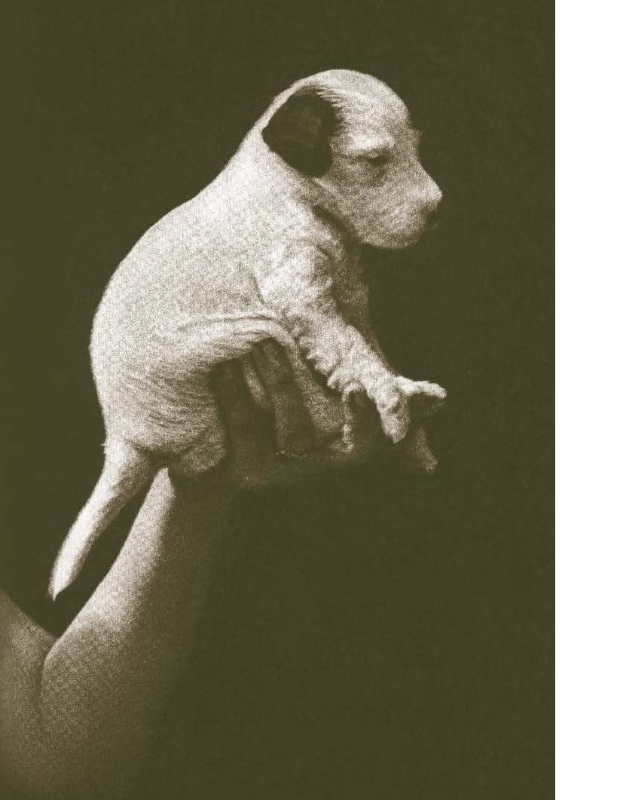

# DÁŠENKA ÈILI ŽIVOT ŠTÌNÌTE

## Karel Èapek

Když se to narodilo, bylo to jenom takové bílé nic, do hrsti se to vešlo; ale anžto to mìlo
pár èerných ušisek a vzadu ocásek, uznali jsme, že to je psisko, a protože jsme si pøáli mít
psí holèièku, dali jsme tomu jméno Dášeòka.
Dokud to bylo bílé nic, bylo to slepé, bez oèí, a co se nožièek týèe, inu, mìlo to dva páry
èehosi, èemu se pøi dobré vùli mohlo øíkat nožièky. Ale protože tu ta dobrá vùle byla, byly
tu i nožièky, tøebaže ještì za mnoho nestály; kdepak, stát se na nich nedalo, takové byly
vratké a slabouèké, a s chùzí to byla, holenku, teprve potíž. Když se do toho Dášeòka
poøádnì obula (totiž ona se neobula, ale vykasala si na to rukávy) (pøesnìji øeèeno, ani
rukávy si nevykasala, ale jenom si, jak se øíká, plivla do dlaní) (rozumìjte mi, ona si ovšem
nemohla plivnout do dlaní, protože ještì plivat neumìla a dlanì mìla tak malièké, že by si
do nich netrefila), zkrátka když se do toho Dášeòka poøádnì dala, dokutálela se za pùl dne
od máminy zadní nohy k máminì noze pøední, pøièemž se cestou tøikrát nakrmila a dvakrát
vyspala. Spát a jíst umìla totiž hned od narození, tomu se uèit nemusela; proto to dìlala
horlivì po celý boží den, a myslím, že i v noci, když se na ni nikdo nedíval, spala stejnì
svìdomitì jako ve dne - takové to bylo pilné štìnì.